<div align="center">



<a href="https://git.io/typing-svg"></a>

<p>
  
  <a href="https://github.com/Muktaditbf?tab=followers"></a>
  
</p>

</div>


## `> whoami`

```ts
const muktadi = {
  role:        ["CSE Student (4th Year)", "Full-Stack AI Developer"],
  building:    ["AI Engineer", "Software Engineer"],      // status: compiling...
  strongest:   "Python — intermediate → expert 🐍",
  passion:     "Cybersecurity — offense to understand, defense to protect",
  university:  "Southeast University, Dhaka 🇧🇩",
  currentFocus:"Grounded AI — assistants that cite sources, never hallucinate",
  stack: {
    frontend: ["React", "Next.js", "TypeScript", "Tailwind CSS"],
    backend:  ["Node.js", "Supabase", "PostgreSQL", "Oracle PL/SQL"],
    mobile:   ["Android (Java)", "JavaFX"],
    core:     ["Python", "Java", "C", "C++"],
    security: ["Kali Linux"],
  },
  motto: "Ship it. Secure it. Make it smarter.",
};
```


## ⚡ Tech Arsenal

<div align="center">

**Languages**<br/>


**Frameworks & Platforms**<br/>


**Tools & Security**<br/>


</div>


## 🚀 Featured Projects

<div align="center">

<a href="https://github.com/Muktaditbf/Course-Grounded-Study-Assistant"></a>
<a href="https://github.com/Muktaditbf/MESS-PRO"></a>
<a href="https://github.com/Muktaditbf/TAKA-BRIDGE-Currency-Converter"></a>
<a href="https://github.com/Muktaditbf/Cyber-Security-Project"></a>

</div>

| # | Project | What it does | Stack |
|:-:|---|---|---|
| 🥇 | **[Course-Grounded Study Assistant](https://github.com/Muktaditbf/Course-Grounded-Study-Assistant)** | Android AI tutor that answers **only** from teacher-approved course material — and refuses instead of hallucinating. Web edition with role-based auth in [Project](https://github.com/Muktaditbf/Project). | `Java` `Android` `AI` `React` `PostgreSQL` |
| 🥈 | **[MESS-PRO](https://github.com/Muktaditbf/MESS-PRO)** | Full-stack mess / shared-meal management platform backed by Supabase auth & database. | `Next.js 16` `React 19` `Supabase` `Tailwind` |
| 🥉 | **[TAKA-BRIDGE](https://github.com/Muktaditbf/TAKA-BRIDGE-Currency-Converter)** | Currency converter for BDT ⇄ world currencies with a database-backed core. | `Java` `PL/SQL` `CSS` |
| 4 | **[Cyber-Security-Project](https://github.com/Muktaditbf/Cyber-Security-Project)** | Penetration-testing assessment portfolio from controlled lab engagements, with defensive recommendations. | `Kali` `Metasploit` `Windows` |
| 5 | **[Soccer-Manager](https://github.com/Muktaditbf/Soccer-Manager)** | Desktop soccer team manager with a JavaFX GUI. | `Java` `JavaFX` |
| 6 | **[CSE Student Routine](https://github.com/Muktaditbf/cse_studet_routine.exe)** | Class-routine web app for CSE students. | `React` `Vite` |
| 7 | **[Islamic Reference Tool](https://github.com/Muktaditbf/Islamic-Reference-Tool-)** | Finds Quran & Hadith evidence (Dalil) by topic. | `Python` |
| 8 | **[VibrantQRCode](https://github.com/Muktaditbf/VibrantQRCode)** | Gradient QR codes with center logo and high error correction. | `Python` |


## 📊 GitHub Analytics

<div align="center">


</div>


## 🛰️ Currently

- 🧠 Building grounded **RAG** pipelines — AI that cites its sources
- 🛡️ Practicing offensive & defensive security in home labs
- 📱 Shipping the Study Assistant to Android
- 🌱 Deep-diving into **AI / LLMs** and **software engineering** practices
- 🤝 Open to collaborating on **AI, full-stack and security** projects

## 🤝 Connect

<div align="center">

<a href="https://github.com/Muktaditbf"></a>
<a href="https://www.linkedin.com/in/muktadi-mohammad"></a>
<a href="mailto:muktadi.exe@gmail.com"></a>
<a href="https://www.facebook.com/muktadi.tbf/"></a>
<a href="https://www.instagram.com/not.muktadiii"></a>

<br/><br/>

<picture>
  <source media="(prefers-color-scheme: dark)" srcset="https://raw.githubusercontent.com/Muktaditbf/Muktaditbf/output/github-snake-dark.svg" />
  <source media="(prefers-color-scheme: light)" srcset="https://raw.githubusercontent.com/Muktaditbf/Muktaditbf/output/github-snake.svg" />
  
</picture>


</div>
